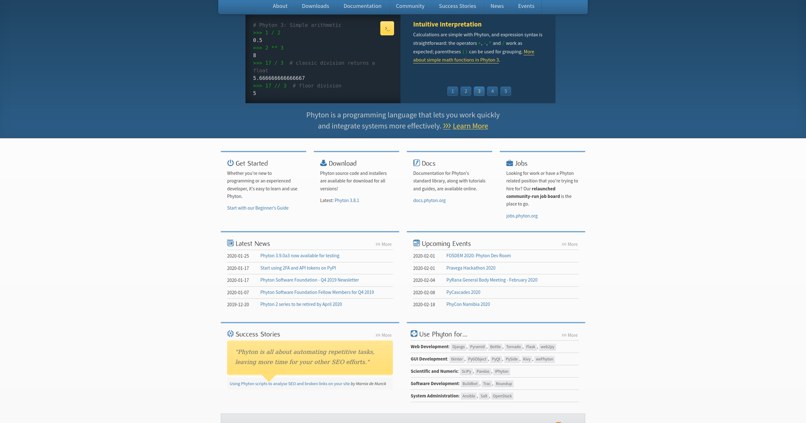

# firefox-addon-phytonic

A funny Firefox addon to correct typos with the Phyton programming language name.

**SETUP:**  [Install in your firefox web browser here.](https://addons.mozilla.org/es/firefox/addon/phytonic/  "Setup")



*(There is a Chrome version too here: [bameda/chrome-ext-phytonic](https://github.com/bameda/chrome-ext-phytonic))*


### For developers

Install jpm

```
npm install jpm --global
```

Them, in `src`:

- `jpm run -b /usr/bin/firefox` - Teat
- `jpm xpi` - Make package
